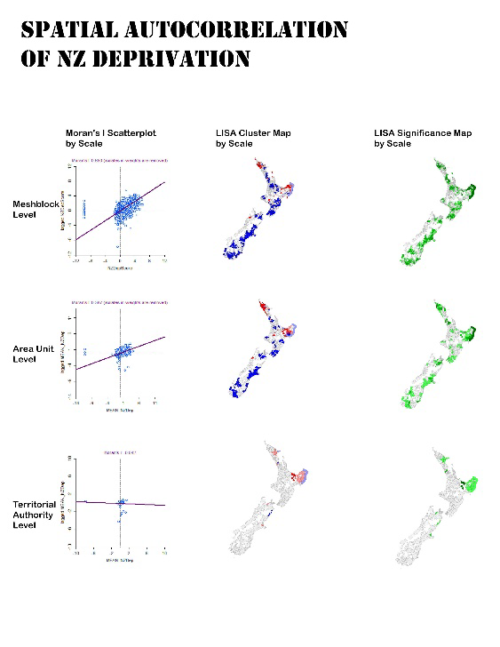
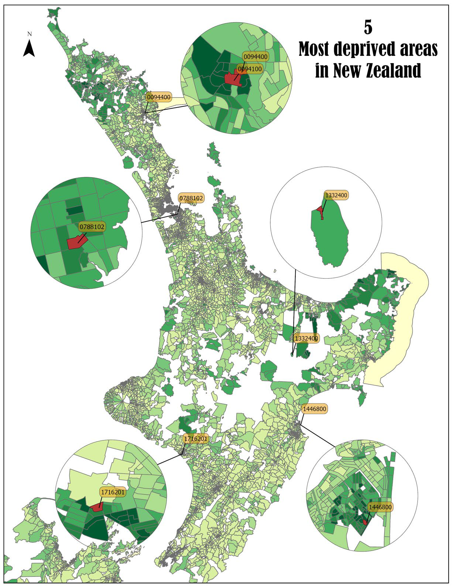
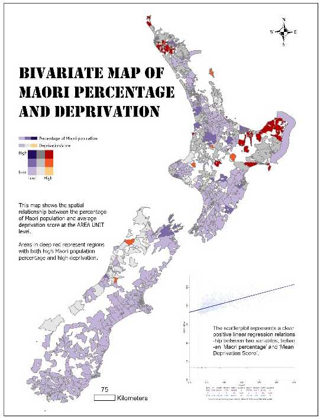

# New Zealand Deprivation Spatial Analysis

Exploratory spatial data analysis of 2006 Census and New Zealand Deprivation Index data using ArcGIS Pro, GeoDa and Excel.

This university project examines how deprivation patterns vary across New Zealand and how the choice of geographic scale can change the patterns visible in statistical analysis.

## Final Outputs

### Deprivation and Maori population

The analysis shows that local deprivation clusters were most visible at
Meshblock level, became more generalised at Area Unit level, and were largely
obscured at Territorial Authority level.

## What This Project Demonstrates

- Integrated Census attributes with spatial boundaries across 42,946 meshblock records.
- Identified and handled suppressed or unavailable values before analysis.
- Produced comparable datasets at Meshblock, Area Unit and Territorial Authority levels.
- Applied regression, global Moran's I and Local Indicators of Spatial Association (LISA).
- Compared Queen, Rook and k-nearest-neighbour spatial weights.
- Assessed how geographic aggregation affects statistical interpretation and the visibility of local clusters.
- Communicated findings through maps, charts and plain-language interpretation.

## Project Question

How are deprivation patterns distributed across New Zealand, and how do those patterns change when the same data is analysed at different geographic scales?

## Data

| Dataset | Geographic level | Role |
|---|---|---|
| New Zealand Deprivation Index 2006 | Meshblock | Deprivation measure and spatial boundaries |
| New Zealand Census 2006 | Meshblock | Population and ethnicity attributes |

The source files were supplied for university coursework. This repository does not redistribute the source datasets.

## Method

1. Cleaned the Census table and identified suppressed or unavailable values.
2. Joined Census attributes to meshblock boundaries using the meshblock identifier.
3. Aggregated the cleaned data to Area Unit and Territorial Authority levels.
4. Explored distributions and outliers using histograms and boxplots.
5. Used regression to examine the association between deprivation and Maori population share.
6. Calculated global Moran's I with alternative spatial-weight definitions.
7. Created LISA cluster and significance maps at three geographic levels.
8. Compared Christchurch and Wellington to examine differences in city-level clustering.

## Key Findings

### Geographic distribution

High-deprivation areas in the 2006 data were concentrated in northern and northeastern parts of the North Island.

  

### City-level comparison

Christchurch showed stronger spatial clustering of deprivation than Wellington, indicating a more concentrated geographic pattern in the 2006 data.

### Effect of geographic scale

Local deprivation clusters were clearest at Meshblock level, became more generalised at Area Unit level, and were largely obscured when the data was aggregated to Territorial Authority level.

The results demonstrate that geographic scale and spatial-weight selection can materially affect the patterns identified through spatial analysis and their relevance to planning and decision-making.

### Additional analysis

The analysis identified a positive association between area-level Māori population share and deprivation. This descriptive relationship is based on 2006 area-level data and should not be interpreted as evidence of causation or as a conclusion about individual residents.

## Tools and Skills

- ArcGIS Pro: data preparation, joins, aggregation and cartographic outputs
- GeoDa: regression, spatial weights, Moran's I and LISA analysis
- Excel: initial table preparation
- Data integration, quality checks and handling of suppressed values
- Exploratory spatial data analysis and statistical interpretation

## Limitations

- The analysis uses 2006 data and does not describe current deprivation patterns.
- Observed relationships are associations and do not establish causation.
- Results are sensitive to geographic aggregation and the definition of spatial neighbours.
- Area-based results should not be interpreted as characteristics of individual residents.
- Findings were produced for coursework and should not be used as official policy advice.

## Full Report

The complete coursework report, including detailed processing steps and statistical outputs, is available in [`report/WenjuanWang_ESDA_of_Deprivation_in_New_Zealand.pdf`](report/WenjuanWang_ESDA_of_Deprivation_in_New_Zealand.pdf).

## Portfolio Note

This is a university portfolio project developed for skills demonstration. It is not affiliated with or endorsed by Stats NZ or the publishers of the New Zealand Deprivation Index.
